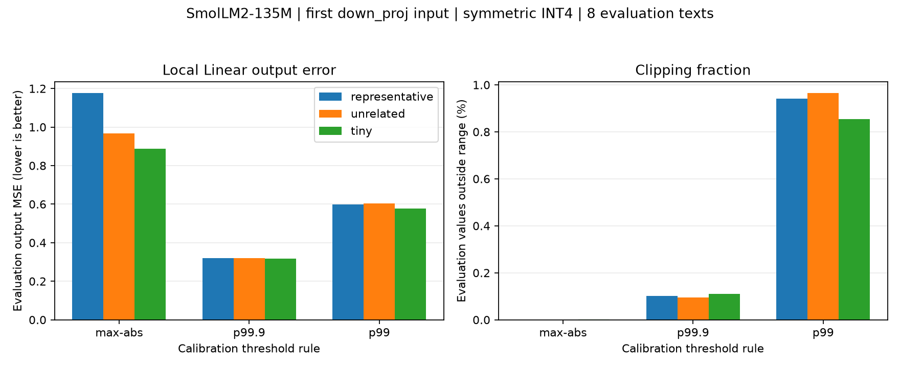

# DAY 4 — Calibration и квантование Transformer: итоги

## Что изучено

- Calibration set: данные для выбора параметров квантования. В сегодняшнем опыте веса модели не обучались.
- Представительность calibration относительно целевого сценария; различие distribution shift и calibration overfitting.
- Distribution shift: несовпадение распределений calibration и целевых данных. В учебном контроле меняли повествовательные тексты на код при одинаковом количестве токенов.
- Calibration overfitting: подстройка выбора параметров под особенности конкретной calibration set в ущерб переносу на новые целевые данные. Проверка требует отдельных целевых текстов, а не только посторонней тематики.
- Меньшая calibration-ошибка сама по себе не гарантирует меньшую ошибку на новых текстах. Выбор правила по evaluation превращает её в набор для подбора; затем нужна новая независимая проверка.
- Путь токена: ID → embedding → Transformer-блоки → финальный RMSNorm → LM head → logits.
- RMSNorm нормирует каждый токен по его координатам, не вычитает среднее, использует epsilon и обучаемый gamma. Не гарантирует отсутствия больших отдельных координат.
- Q/K определяют scores и веса внимания; V несёт смешиваемую информацию. Causal mask запрещает будущие позиции, но разрешает текущую.
- В одной голове A имеет форму [L,L], V — [L,d_v], Z=AV — [L,d_v].
- Результаты голов объединяются и проходят O-проекцию. В модели grouped-query attention: 9 query-голов и 3 key/value-головы; к Q/K применяется RoPE.
- Residual прибавляет attention/MLP-добавку к исходному hidden state, а не заменяет его. Сам по себе не устраняет ошибку добавки.
- MLP: gate/up расширяют вектор; SiLU(gate) покоординатно умножается на up; down возвращает hidden-размерность.
- LM head выдаёт оценки элементов словаря, не hidden-векторы. Embedding и LM head используют общие веса.
- Входы Q/K/V одного блока совпадают, поэтому их входные статистики одинаковы; веса и выходы проекций разные.

## Формулы, которые связали теорию с экспериментом

Для Linear используем W[out,in]:

$$
Y=XW^\top,\qquad \hat Y=\hat XW^\top,
$$
$$
E=Y-\hat Y=(X-\hat X)W^\top.
$$

В сегодняшнем опыте квантуется только вход, поэтому весовая ошибка равна нулю, но ошибка выхода может быть ненулевой.

Статическое симметричное fake-квантование:

$$
Q=2^{b-1}-1,\qquad s=\alpha/Q,
$$
$$
\hat X=s\cdot\operatorname{clip}(\operatorname{round}(X/s),-Q,Q).
$$

Для INT4 используем коды от -7 до 7. Alpha выбирается только по calibration и не пересчитывается на evaluation. При alpha=0 восстановление возвращает нули.

Метрики:

$$
\mathrm{MSE}_X=\operatorname{mean}((X-\hat X)^2),
$$
$$
\mathrm{MSE}_Y=\operatorname{mean}((Y-\hat Y)^2),
$$
$$
c=\frac{\#\{i:|X_i|>\alpha\}}{\text{число элементов }X}.
$$

Связь с MLP: при фиксированном gate ошибка up-ветки даёт delta_m = g ⊙ delta_p. Чувствительность ошибки зависит от окружающих активаций.

## Что реализовано и сохранено

Совместно подготовлены инфраструктура запусков и проверки; самостоятельно заполнены основные вычисления статистик, запись hook-результатов, захват активаций, fake-квантователь, метрики, выбор порога и извлечение данных для графика.

Артефакты хранятся в `artefacts/`; скрипты и этот журнал остаются в корне D04.

- `day4_inspect.py`, `artefacts/linear_shapes.txt`: имена и формы семи Linear-проекций первого блока и LM head.
- `artefacts/quantization_map.md`: тензор → место возникновения → возможность квантования → механизм риска.
- `day4_hooks.py`, `artefacts/linear_input_stats.csv`: 211 Linear-модулей, по 8 статистик входных активаций для одного текста.
- `artefacts/stats_preview.txt`: промежуточные ручные проверки и статистики входа/выхода одного q_proj.
- `artefacts/single_layer_stats.txt`: контроль сохранения одной записи под точным именем слоя.
- `artefacts/calibration_texts.json`: фиксированный искусственный учебный корпус.
- `day4_calibration.py`, `artefacts/calibration_snapshot.pt`: сбор и сохранение FP32-входов первого down_proj, его весов и метаданных.
- `day4_experiment.py`, `artefacts/max_abs_results.csv`: сравнение трёх calibration sets при фиксированном правиле max-abs.
- `day4_thresholds.py`, `artefacts/threshold_policy_results.csv`: 9 вариантов — три calibration sets × три правила порога.
- `day4_plot.py`, `artefacts/calibration_comparison.png`: график evaluation output MSE и доли значений вне диапазона.

### Конвенции статистик

- min, max, mean, std, abs_max — по всем элементам входного тензора.
- std: деление на N, `correction=0`.
- p99/p99.9: квантили модулей, уровни 0.99/0.999, линейная интерполяция PyTorch.
- Pearson kurtosis: mean((x−mean)^4) / std^4, без вычитания 3; при std=0 — NaN.
- Общие квантили вычисляются по объединённым значениям, не усреднением квантилей отдельных текстов.
- `artefacts/linear_input_stats.csv` — снимок одного текста, не агрегат calibration set. Hooks только на Linear не наблюдают отдельно все операции Transformer.

## Окружение и протокол

- Python 3.11.16; PyTorch 2.5.1+cu121; Transformers 4.40.2.
- NVIDIA GTX 1050 Ti, 4 GB VRAM, архитектура sm_61. Проверено реальное матричное умножение на CUDA.
- Модель: `HuggingFaceTB/SmolLM2-135M`.
- Ревизия: `93efa2f097d58c2a74874c7e644dbc9b0cee75a2`.
- FP32, `eval()`, `inference_mode()`, eager attention, `use_cache=False`.
- Исследуемый слой: `model.layers.0.mlp.down_proj`, W формы [576,1536].
- Активации собраны на GPU; локальные квантование и метрики рассчитаны на сохранённых CPU-тензорах.
- Каждый текст обрабатывается отдельно; берём первые 32 токена, без padding.
- Representative: 8 повествовательных текстов, 256 токенов, X формы [256,1536].
- Unrelated: 8 фрагментов кода, 256 токенов, X формы [256,1536].
- Tiny: первый representative-текст, 32 токена, X формы [32,1536].
- Evaluation: 8 отдельных повествовательных текстов, 256 токенов, X формы [256,1536].
- Точных совпадений calibration/evaluation-текстов нет. Все исходные тексты длиннее 32 токенов.
- Тексты искусственно подготовлены для обучения; соответствие реальному целевому распределению не установлено.
- При всех сравнениях evaluation-активации и веса фиксированы. Масштаб один на весь исследуемый вход слоя, не per-channel или groupwise.

## Что проверено

### Ручные и программные контроли

- На (-10,1,2) проверены min=-10, max=2, mean≈-2.333333, abs_max=10.
- На (-3,3) проверена std=3 при correction=0.
- На (-20,0,10) проверены квантили модулей: p99≈19.8, p99.9≈19.98.
- На (-1,1) Pearson kurtosis=1; на (2,2) std=0 и kurtosis=NaN.
- Сборщик дал ровно 211 отдельных имён, по 8 статистик; hooks сняты после forward.
- Tiny-активации точно совпали с первыми 32 строками representative-активаций.
- Сохранённые входы и веса конечны; размер весов проверен.
- Fake-квантование проверено на clipping, точно представимых значениях, alpha=0, другой разрядности, неизменности входа и отдельном случае округления без clipping: ±0.26 → ±0.3 при alpha=0.7, INT4.
- Метрики проверены на X=0.26, X_hat=0.30, W=2: activation MSE≈0.0016, output MSE≈0.0064, clipping=0.
- Отдельно проверена доля clipping 2/3.
- Во втором эксперименте max-abs результаты первого запуска воспроизвелись.

### Эксперимент 1 — max-abs calibration

**Гипотеза:** representative calibration даст меньшую evaluation output MSE, чем unrelated и tiny.

| Calibration | Alpha | Шаг | Activation MSE | Output MSE | Clipping, % |
|---|---:|---:|---:|---:|---:|
| representative | 8.098298 | 1.156900 | 0.010914 | 1.176880 | 0 |
| unrelated | 6.699943 | 0.957135 | 0.009694 | 0.967053 | 0.000254 |
| tiny | 6.244386 | 0.892055 | 0.009234 | 0.887762 | 0.002035 |

Гипотеза не подтвердилась в проверенной настройке: representative проиграла обоим вариантам. Это не доказывает общего преимущества tiny или unrelated calibration.

### Эксперимент 2 — правило порога

Exploratory follow-up после просмотра evaluation первого эксперимента. Проверены заранее заданные max-abs, p99.9 и p99 модулей; пороги по-прежнему рассчитываются только на соответствующей calibration set.

| Calibration | Правило | Alpha | Calibration output MSE | Evaluation output MSE | Evaluation clipping, % |
|---|---|---:|---:|---:|---:|
| representative | max-abs | 8.098298 | 1.248950 | 1.176880 | 0 |
| representative | p99.9 | 1.873222 | 0.318081 | 0.318997 | 0.101471 |
| representative | p99 | 0.572104 | 0.609642 | 0.599333 | 0.940959 |
| unrelated | max-abs | 6.699943 | 0.809050 | 0.967053 | 0.000254 |
| unrelated | p99.9 | 1.924805 | 0.316679 | 0.319134 | 0.095622 |
| unrelated | p99 | 0.565189 | 0.609492 | 0.605062 | 0.965373 |
| tiny | max-abs | 6.244386 | 0.996532 | 0.887762 | 0.002035 |
| tiny | p99.9 | 1.791517 | 0.301971 | 0.318410 | 0.109355 |
| tiny | p99 | 0.598212 | 0.547611 | 0.578414 | 0.854238 |

## Наблюдения и выводы

- Выбор calibration меняет диапазон и локальную output MSE; направление эффекта не следует только из типа или размера выборки.
- На этих данных p99.9 выиграла у max-abs и p99 для всех трёх calibration sets, и на calibration, и на evaluation.
- Для representative уменьшение порога 8.0983 → 1.8732 улучшило output MSE, а дальнейшее уменьшение до 0.5721 ухудшило её.
- Нулевой clipping не гарантирует минимальной ошибки: широкий диапазон даёт более крупный шаг округления. Слишком узкий диапазон добавляет ошибки clipping. Разделение вкладов этих ошибок отдельно не измерялось.
- Среди проверенных правил смены лучшего при переносе calibration → evaluation не обнаружено. Calibration overfitting разобран как риск, но данным экспериментом не доказан.
- Tiny дала минимальную точечную evaluation output MSE среди групп при каждом правиле. При p99.9 различия групп малы; статистическая значимость и устойчивость рейтинга не установлены.

## Ограничения и что пока не проверено

- Квантуется локальный вход одного Linear-слоя на активациях исходной FP32-модели, не полный forward квантованной LLM.
- Не измерены perplexity, качество генерации, скорость, низкобитная упаковка и реальная экономия памяти.
- Только маленький искусственный корпус, один слой, одна разрядность, один способ масштабирования. Tiny выбрана одна, а не серия независимых повторов.
- Не искали оптимальный порог по непрерывному диапазону или широкой сетке.
- Не измерены доверительные интервалы или устойчивость к составу данных.
- Evaluation уже просмотрена и использована для мотивации следующего исследования; для независимой проверки выбранной настройки нужен свежий набор.
- Не установлена независимость текстов от pretraining модели; отсутствие точных дубликатов относится только к нашему calibration/evaluation-разделению.
- Реализация kurtosis использует unique для проверки постоянного тензора; это корректно для проверенных входов, но избыточно для массового сбора. Возможна дальнейшая оптимизация с переиспользованием mean/std.
- По текущей самооценке незакрытых вопросов нет. Самостоятельное воспроизведение кода без каркаса ещё не проверено.

## Следующий эксперимент — предложен, ещё не выполнен

**Гипотеза:** при выборе alpha по calibration output MSE маленькая calibration set сильнее зависит от состава текстов: разброс выбранных порогов и ошибки на свежих целевых текстах будет больше, чем для полной calibration set.

**Контролируемый метод:**

1. Сохранить сегодняшние корпус и снимок без изменений. Подготовить новый отдельный набор повествовательных evaluation-текстов; не смотреть его ошибки до фиксации протокола.
2. Сохранить слой, FP32-веса, INT4 и длину 32 токена. Заранее зафиксировать сетку из 21 положительного alpha от 0.1 до 10 с логарифмическим шагом.
3. Используя восемь исходных representative-текстов, выполнить 32 повторения с seed=42. В каждом повторении выбрать восемь текстов с возвращением; tiny — первый выбранный текст, full — все восемь. Это вложенное сравнение объёма при одном целевом типе данных.
4. Для tiny и full независимо выбрать alpha по минимуму **calibration output MSE**, не по свежей evaluation.
5. Измерить output MSE на одном и том же новом наборе. Сохранить распределения alpha и evaluation MSE, средние и разброс, а не только лучшую точку.
6. Проверить гипотезу о разбросе; отдельно оценить перенос выбранных параметров. Не объявлять любую разницу calibration/evaluation доказательством overfitting.

Это bootstrap-проверка на восьми исходных учебных текстах; для обобщения потребуется более крупный реальный корпус.
